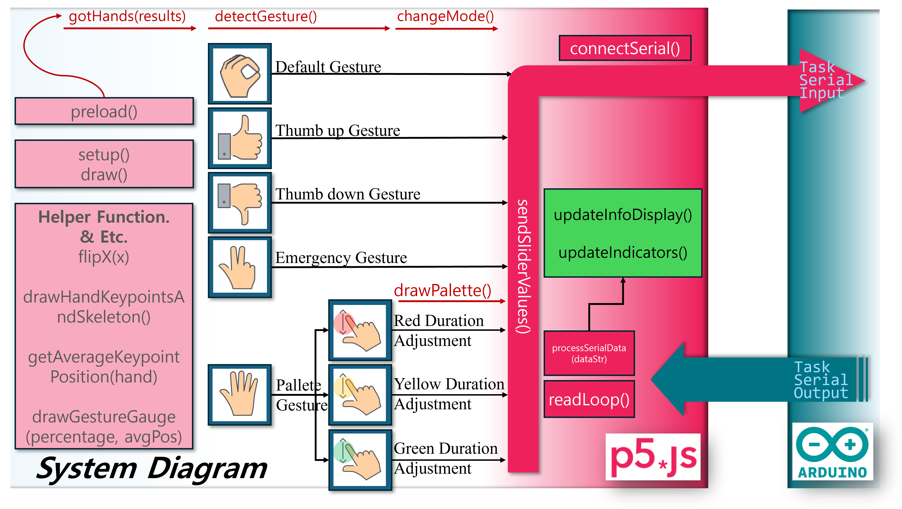
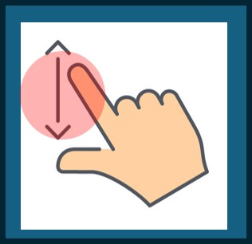
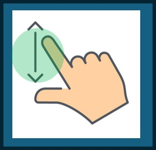

# (확장) 임베디드 통신시스템 프로젝트 - 핸드포즈 제어 신호등

이 확장된 프로젝트는 **ml5.js**의 HandPose 모델로 웹캠에서 감지한 손동작을 분석하고, 이를 아두이노 신호등 제어 로직과 연동하여 **긴급 모드(적색 LED만 ON)**, **모든 LED on/off**, **모든 LED off**, 그리고 **팔레트 모드** 등을 직관적으로 전환할 수 있도록 구성했습니다.


---

## 시연영상
아래 영상을 통해 손동작 인식 과정과, 그에 따라 실시간으로 반응하는 LED 신호등을 확인할 수 있습니다.

[](https://youtu.be/Tw107Br5D0Y)

---

## 개요
본 프로젝트는 기존의 버튼·슬라이더·가변저항 위주의 신호등 제어 방식을 **비전 기반 제스처 인식**으로 확장하는 것이 목표입니다. 웹캠 영상을 **HandPose**로 분석해 특정 손동작을 감지하면, 시리얼 통신을 통해 아두이노로 명령을 전송합니다.

아두이노 측에서는 **TaskSerialInput**과 **TaskSerialOutput** 테스크를 통해 4가지 모드 변경(긴급, 모든 LED on/off, 모든 LED off, 기본)과 LED 점멸 주기 변경 등 사용자의 요청을 **즉각 반영**합니다. 이로써 사용자는 **직관적인 손동작**만으로 긴급 모드, 모든 LED on/off, 팔레트 모드 등을 자유롭게 전환하거나, 팔레트 모드에서 **빨강·노랑·초록 LED 각각의 주기**를 섬세하게 조절할 수 있습니다.

---

## 시스템 다이어그램
Arduino와 PC(웹 브라우저)가 **시리얼 통신**으로 연결되며, 웹 브라우저에서는 **p5.js**와 **Web Serial API**를 통해 데이터를 송수신합니다. 다양한 손동작(비전 패턴)을 인식하여 신호등의 모드 및 점등 주기를 실시간으로 제어할 수 있습니다.



---

## 손동작(비전패턴) 정의

아래 표는 5가지 **손동작작**과 **팔레트 모드**에서의 색상 선택 과정을 요약한 것입니다. 각 동작은 LED 패턴 혹은 모드를 매핑해, 신호등 제어를 더욱 유연하고 편리하게 만듭니다.

### 주요 손동작 
<table style="width:100%; table-layout: fixed; border-collapse: collapse;" border="1">
  <tr>
    <th style="width:16.66%;">손동작</th>
    <th style="width:16.66%;">Default</th>
    <th style="width:16.66%;">Emergency</th>
    <th style="width:16.66%;">ThumbsUp</th>
    <th style="width:16.66%;">ThumbsDown</th>
    <th style="width:16.66%;">Palette</th>
  </tr>
  <tr>
    <th style="width:16.66%;">패턴 이미지</th>
    <td><div align="center"></div></td>
    <td><div align="center"></div></td>
    <td><div align="center"></div></td>
    <td><div align="center"></div></td>
    <td><div align="center"></div></td>
  </tr>
  <tr>
    <th style="width:16.66%;">설명</th>
    <td>손가락이 모두 모여 있는 상태. 기본 신호등 패턴 유지</td>
    <td>엄지·검지·중지를 펴고 약지·새끼를 접은 상태. 긴급 모드(적색 LED)로 전환</td>
    <td>엄지만 위로 든 동작. 모든 LED를 동일 주기로 깜빡이게 하는 모드로 전환</td>
    <td>엄지만 아래로 향한 동작. 모든 LED가 꺼지는 모드로 전환</td>
    <td>다섯 손가락을 펼쳐 팔레트 모드 진입. LED 색상·주기 조절 UI 활성화</td>
  </tr>
</table>
<br>

### 팔레트모드 진입 후 색상별 주기 선택
<!-- 2. 팔레트 모드 색상 선택 -->
<table style="width:100%; table-layout: fixed; border-collapse: collapse;" border="1">
  <tr>
    <th style="width:25%;">색상 선택</th>
    <th style="width:25%;">Red LED</th>
    <th style="width:25%;">Yellow LED</th>
    <th style="width:25%;">Green LED</th>
  </tr>
  <tr>
    <th style="width:16.66%;">패턴 이미지</th>
    <td><div align="center"></div></td>
    <td><div align="center"></div></td>
    <td><div align="center"></div></td>
  </tr>
  <tr>
    <th style="width:16.66%;">설명</th>
    <td>엄지·검지를 빨간 원 위에 동시에 위치 → 빨간 LED의 주기(또는 밝기) 조절</td>
    <td>엄지·검지를 노란 원 위에 동시에 위치 → 노랑 LED의 주기(또는 밝기) 조절</td>
    <td>엄지·검지를 초록 원 위에 동시에 위치 → 초록 LED의 주기(또는 밝기) 조절</td>
  </tr>
</table>
<br>

> **<팁!>**  
> a. 팔레트 모드에서 **색상 원 안에 손가락을 약 750ms 이상 유지**하면, 손가락 사이 거리(`fingerDistance`)를 바탕으로 `signalPeriod`나 **LED 밝기**를 **실시간**으로 조절할 수 있습니다.   
> b. 활성화된 팔레트의 최대 지름은 5000ms, 최소 지름은 100ms로 매핑되어있습니다.  
> c. 팔레트 모드 내에서는 원활한 주기제어를 위해 다른 모드로의 전환이 불가하도록 설정했습니다.  

이를 통해 사용자는 빨강·노랑·초록 LED 각각의 깜빡임 속도나 밝기를 손쉽게 변경하여,  
원하는 신호등 패턴을 자유롭게 구현할 수 있습니다.

---

### 추가 사항

- **왼손/오른손 모두 지원**  
  - HandPose를 활용하여 양손 구분 없이 **손가락 관절 포인트**를 인식하도록 구현하였습니다. 왼손/오른손 어느 쪽을 사용해도 동일하게 동작합니다. 
  - 다만, 손가락 펼침 방향에 따라 제스처가 미세하게 달라 보일 수 있으므로, 카메라 각도에 맞춰 손을 인식하는 것이 좋습니다.

- **가깝고 먼 상황 모두에서 인식지원**
  - `handSize = dist(wrist.x, wrist.y, middleTip.x, middleTip.y)` 형태로 손목과 중지 끝 사이 거리를 측정하고, 이를 기준으로 `closeThreshold` (예: `handSize * 0.2`)를 설정하여 손가락이 모여있는지 판단합니다.  
  - 또한, `factor = 1.2`처럼 손가락 확장 여부를 결정하는 계수를 도입해, 손의 크기가 달라져도 동일한 비율 기준으로 판별하도록 설계되었습니다.  
  - 이 접근법은 카메라와 손의 실제 거리가 달라지더라도, **상대적 비율**을 사용하기 때문에 제스처 인식의 정확도가 크게 떨어지지 않습니다.  

- **쿨다운(gestureTimer) 게이지**  
  - 특정 제스처(엄지 위, 엄지 아래 등)를 **1초 이상** 유지하면 최종 확정하도록 하는 로직입니다.  
  - `gestureTimer`와 `gestureThreshold`를 사용해, 매 프레임(`draw()`)마다 제스처 유지 시간을 측정하고,  
    `drawGestureGauge(progress, avgPos)`로 **시각적 게이지**를 표시합니다.  
  - 이를 통해 **순간적인 흔들림**에 의해 잘못 모드가 전환되는 것을 방지하고,  
    사용자가 **1초 쿨다운**이 얼마나 진행됐는지 직관적으로 확인할 수 있습니다.

- **언노운(Unknown) 제스처**  
  - 정의되지 않은 동작(예: 새끼손가락, 검지손가락만 올리는 등)은 **언노운** 상태로 처리해 모드 전환에 영향을 주지 않습니다.  
  - 언노운 상태를 활용하여 동일한 모드를 반복적으로 전환하고자 할 때 [예) Default -> Default], 팔레트 모드 진입·이탈할 때, 원활한 제어를 돕습니다.

- **카메라**:  
  - 이 프로젝트는 일반 노트북 내장 카메라 대신, **Logitech Brio 500** 외장 카메라 기반으로 테스트되었습니다.  
  - 일반적으로 **다른 웹캠**이라도 브라우저에서 인식되는 장치라면 사용 가능합니다.

- **상세 코드 설명**:  
  - `arduino` 폴더 내부에는 **신호등 제어 로직**과 **TaskScheduler** 세부 내용이,  
  - `p5` 폴더 내부에는 **HandPose + Web Serial API** 연동 로직이  
  각각 `README.md`에 더 자세히 기술되어 있습니다.

---

# (기존) 임베디드 통신시스템 프로젝트 - 신호등

## 시연 영상
아래 링크를 통해 신호등 프로젝트의 실제 동작 영상을 확인할 수 있습니다.

[](https://youtu.be/O_3jzSIpDpo)

[저지연 테스트 영상](https://youtube.com/shorts/vEpxeKrXdfU)입니다. 실제 동작에는 미러링으로 인한 지연이 없습니다.


---

## 개요
본 프로젝트는 Arduino를 이용해 신호등 패턴을 구현하고, 웹(브라우저) 환경에서 직관적인 UI를 통해 LED 상태와 지속 시간을 제어하는 시스템입니다. **TaskScheduler**와 **PinChangeInterrupt** 라이브러리를 사용하여 아두이노 측에서 상태 머신을 구현하였고, 웹 인터페이스는 **p5.js**와 **Web Serial API**를 활용해 실시간 시리얼 통신 및 사용자 인터랙션을 지원합니다.

---

## 시스템 다이어그램
아래 이미지는 프로젝트의 전체적인 구성도를 나타냅니다. Arduino와 PC(웹 브라우저)가 시리얼 통신을 통해 연결되고, 웹 브라우저에서는 p5.js를 사용해 UI 및 시리얼 인터랙션을 제공합니다.


---

## 하드웨어 구성

### 1. 아두이노 회로도
아래 이미지는 Arduino 보드와 LED, 버튼, 가변저항 등이 어떻게 연결되는지를 개략적으로 보여줍니다.


또한, 실제 배선 예시는 다음과 같습니다:


### 2. 핀 연결 상세

| 핀 번호 | 연결된 부품        | 설명                                                                              |
|:------:|:-------------------|:----------------------------------------------------------------------------------|
| **D9**  | 초록 LED(Green)    | PWM 출력 핀, 가변저항을 통해 밝기 제어가 가능                                      |
| **D10** | 노랑 LED(Yellow)   | PWM 출력 핀, 가변저항을 통해 밝기 제어가 가능                                      |
| **D11** | 빨강 LED(Red)      | PWM 출력 핀, 가변저항을 통해 밝기 제어가 가능                                      |
| **D2**  | 버튼3              | 모드3(LED 끔) 전환용 버튼, 내부 풀업(Input Pull-up)                                 |
| **D3**  | 버튼2              | 모드2(전체 LED 토글) 전환용 버튼, 내부 풀업(Input Pull-up)                          |
| **D4**  | 버튼1              | 모드1(빨강 LED 고정) 전환용 버튼, 내부 풀업(Input Pull-up)                          |
| **A5** | 가변저항           | 0-1023 범위를 읽어 LED 밝기(0-255)로 매핑                                           |
| **5V/GND** | 전원, 접지    | LED, 버튼, 가변저항에 전력 공급 및 회로 구성을 위한 공통 접지                         |

> **내부 풀업 설명**  
> `pinMode(BUTTONx, INPUT_PULLUP);`으로 설정 시, 버튼이 눌리지 않았을 때는 핀 상태가 **HIGH**가 되고, 버튼을 누르면 **LOW**로 바뀝니다. 모든 버튼은 INPUT_PULLUP으로 설정합니다.
> 
> **OUTPUT 핀 모드 설명**  
> `pinMode(LED_COLOR, OUTPUT);`와 같이 설정하면 해당 핀을 출력 모드로 사용합니다. LED 제어용 PWM 핀을 OUTPUT으로 지정하여 원하는 밝기를 출력할 수 있습니다.
>
> **가변저항 analogRead()**  
> `analogRead(POTENTIOMETER);` 함수를 사용해 0-1023 범위의 값을 읽어들이며, 이를 `map()` 함수를 통해 0-255 범위의 LED 밝기나 다른 제어 파라미터로 변환할 수 있습니다.  
> 예: `brightness = map(analogRead(A5), 0, 1023, 0, 255);`
---

## 소프트웨어 개요

### 1. Arduino 측 (하드웨어 제어)
- **TaskScheduler**와 **PinChangeInterrupt** 라이브러리를 사용해 **상태 머신**, **버튼 인터럽트**, **시리얼 통신**을 관리합니다.
- **`main.cpp`**:  
  - **setup()**: 핀 모드 설정, TaskScheduler 초기화, 인터럽트 설정  
  - **loop()**: 가변저항 값 읽어 LED 밝기 결정, 상태 머신 업데이트(또는 모드 전환 처리)  
  - **시리얼 통신**: LED 패턴, 밝기, 모드 정보 송수신  
  - **버튼 인터럽트**: 버튼 누름 감지 → 모드1, 모드2, 모드3 전환  

### 2. 웹 인터페이스(p5 폴더)
- **p5.js**를 활용한 UI 구성 및 Web Serial API로 Arduino와 통신.
- **`index.html`** / **`sketch.js`**:  
  - **슬라이더**를 통해 Red/Yellow/Green LED의 지속 시간을 설정  
  - **Connect Serial** 버튼으로 시리얼 포트 선택 후 연결  
  - **실시간 데이터**(LED 상태, 모드, 밝기)를 수신해 웹 UI에 반영  

---

## 사용 방법

1. **Arduino 펌웨어 업로드**  
   - `arduino` 폴더 내 `src/main.cpp` 코드를 Arduino IDE 또는 PlatformIO로 빌드 & 업로드  
   - 필요한 라이브러리(TaskScheduler, PinChangeInterrupt)를 사전에 설치

2. **웹 인터페이스 실행**  
   - `p5` 폴더의 `index.html`을 Chrome 등 Web Serial API 지원 브라우저에서 엽니다.  
   - **Connect Serial** 버튼 클릭 → Arduino 포트 선택 → 연결

3. **슬라이더 조작**  
   - Red/Yellow/Green 슬라이더를 움직여 LED 유지 시간을 변경  
   - 변경된 값은 시리얼로 전송되어 Arduino의 신호등 패턴에 반영

4. **버튼 조작**  
   - Arduino에 연결된 버튼(2,3,4번 핀)을 눌러 **모드1(빨강 고정)**, **모드2(전체 토글)**, **모드3(모두 끔)** 을 전환  
   - 다시 버튼을 누르면 해당 모드가 비활성화되고 기본 신호등 패턴으로 복귀

---

## 주의 사항

- **전원 공급**: LED, 버튼, 가변저항 등 주변 장치가 많은 경우, 외부 전원을 사용하거나 전류 제한에 유의해야 합니다.  
- **PWM 핀 충돌**: 9, 10, 11번 핀이 다른 기능(PWM 외 SPI, I2C 등)과 겹치지 않도록 주의.  
- **Web Serial API**: 최신 버전의 Chrome 계열 브라우저에서만 동작합니다.

---

## 디렉터리 구조

아래는 **ECS_TRAFFIC_LIGHT_HANDPOSE_CONTROL** 프로젝트의 전체 폴더 구성입니다.  
Arduino 쪽은 **PlatformIO** 기반으로, 웹 쪽은 **p5** 폴더 안에 배치되어 있습니다.

```plaintext
ECS_TRAFFIC_LIGHT_HANDPOSE_CONTROL/
├── arduino
│   ├── .pio
│   ├── .vscode
│   ├── include
│   ├── lib
│   ├── src
│   │   └── main.cpp               # 아두이노 신호등 제어 메인 코드
│   ├── test
│   ├── .gitignore
│   ├── platformio.ini             # PlatformIO 설정 파일
│   └── README.md                  # (아두이노 관련 설명이 포함될 수 있음)
├── image
│   ├── Arduino_circuit_diagram.png  # 아두이노 회로도 이미지 1
│   ├── Arduino_circuit.jpg          # 아두이노 회로도 이미지 2
│   ├── gesture_default.jpg          # 기본(Default) 손동작 이미지
│   ├── gesture_emergency.jpg        # 긴급(Emergency) 손동작 이미지
│   ├── gesture_thumbsdown.jpg       # 엄지 아래(ThumbsDown) 손동작 이미지
│   ├── gesture_thumbsup.jpg         # 엄지 위(ThumbsUp) 손동작 이미지
│   ├── gesture_palette.jpg          # 팔레트(Palette) 손동작 이미지
│   ├── palette_red.jpg             # 팔레트 모드에서 빨간 LED 선택 시연 이미지
│   ├── palette_yellow.jpg          # 팔레트 모드에서 노랑 LED 선택 시연 이미지
│   ├── palette_green.jpg           # 팔레트 모드에서 초록 LED 선택 시연 이미지
│   ├── S1_System_Diagram.png       # 시스템 다이어그램 (신호등 일반 버전)
│   └── S2_System_Diagram.png       # 시스템 다이어그램 (신호등 확장 버전)
├── p5
│   ├── index.html            # 웹 UI (HTML)
│   ├── README.md             # (p5 관련 설명이 포함될 수 있음)
│   ├── sketch.js             # p5.js 스케치 (시리얼 통신, UI 제어)
│   └── style.css             # 웹 UI 스타일
│
├── LICENSE
└── README.md                 # 최상위 README
```
---

## 라이선스

이 프로젝트는 [MIT License](./LICENSE) 하에 오픈소스로 공개됩니다.

## 추가 참고
더 자세한 설명은 각 폴더(arduino, p5) 내의 README.md와 코드의 주석을 참고해주세요.  
필요한 설정, 함수별 동작 원리, 그리고 확장 아이디어가 상세히 기재되어 있습니다.