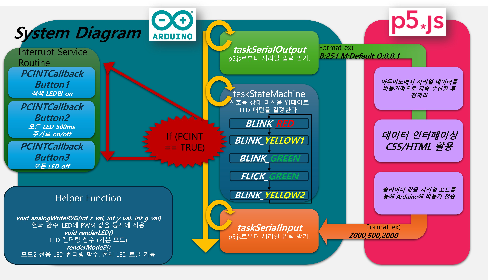
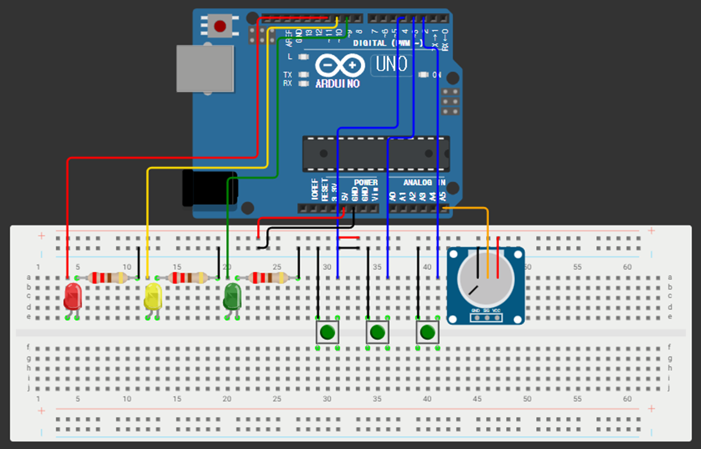
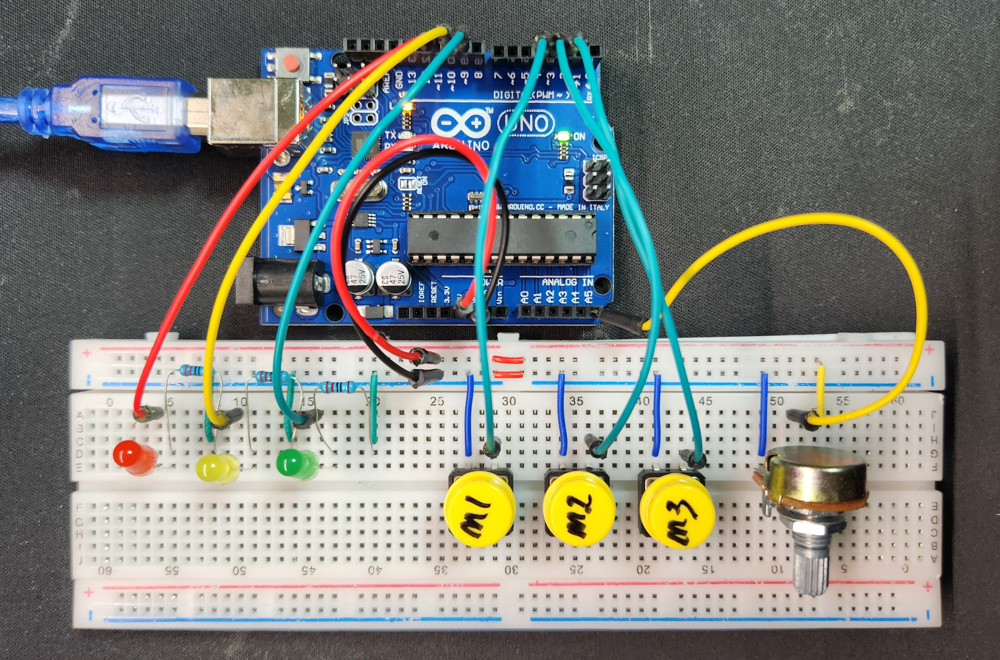

# 임베디드 통신시스템 프로젝트 - 신호등

## 시연 영상
아래 링크를 통해 신호등 프로젝트의 실제 동작 영상을 확인할 수 있습니다.

[](https://youtu.be/O_3jzSIpDpo)

[저지연 테스트 영상](https://youtube.com/shorts/vEpxeKrXdfU)입니다. 실제 동작에는 미러링으로 인한 지연이 없습니다.


---

## 개요
본 프로젝트는 Arduino를 이용해 신호등 패턴을 구현하고, 웹(브라우저) 환경에서 직관적인 UI를 통해 LED 상태와 지속 시간을 제어하는 시스템입니다. **TaskScheduler**와 **PinChangeInterrupt** 라이브러리를 사용하여 아두이노 측에서 상태 머신을 구현하였고, 웹 인터페이스는 **p5.js**와 **Web Serial API**를 활용해 실시간 시리얼 통신 및 사용자 인터랙션을 지원합니다.

---

## 시스템 다이어그램
아래 이미지는 프로젝트의 전체적인 구성도를 나타냅니다. Arduino와 PC(웹 브라우저)가 시리얼 통신을 통해 연결되고, 웹 브라우저에서는 p5.js를 사용해 UI 및 시리얼 인터랙션을 제공합니다.



---

## 하드웨어 구성

### 1. 아두이노 회로도
아래 이미지는 Arduino 보드와 LED, 버튼, 가변저항 등이 어떻게 연결되는지를 개략적으로 보여줍니다.



또한, 실제 배선 예시는 다음과 같습니다:



### 2. 핀 연결 상세

| 핀 번호 | 연결된 부품        | 설명                                                                              |
|:------:|:-------------------|:----------------------------------------------------------------------------------|
| **D9**  | 초록 LED(Green)    | PWM 출력 핀, 가변저항을 통해 밝기 제어가 가능                                      |
| **D10** | 노랑 LED(Yellow)   | PWM 출력 핀, 가변저항을 통해 밝기 제어가 가능                                      |
| **D11** | 빨강 LED(Red)      | PWM 출력 핀, 가변저항을 통해 밝기 제어가 가능                                      |
| **D2**  | 버튼3              | 모드3(LED 끔) 전환용 버튼, 내부 풀업(Input Pull-up)                                 |
| **D3**  | 버튼2              | 모드2(전체 LED 토글) 전환용 버튼, 내부 풀업(Input Pull-up)                          |
| **D4**  | 버튼1              | 모드1(빨강 LED 고정) 전환용 버튼, 내부 풀업(Input Pull-up)                          |
| **A5** | 가변저항           | 0-1023 범위를 읽어 LED 밝기(0-255)로 매핑                                           |
| **5V/GND** | 전원, 접지    | LED, 버튼, 가변저항에 전력 공급 및 회로 구성을 위한 공통 접지                         |

> **내부 풀업 설명**  
> `pinMode(BUTTONx, INPUT_PULLUP);`으로 설정 시, 버튼이 눌리지 않았을 때는 핀 상태가 **HIGH**가 되고, 버튼을 누르면 **LOW**로 바뀝니다. 모든 버튼은 INPUT_PULLUP으로 설정합니다.
> 
> **OUTPUT 핀 모드 설명**  
> `pinMode(LED_COLOR, OUTPUT);`와 같이 설정하면 해당 핀을 출력 모드로 사용합니다. LED 제어용 PWM 핀을 OUTPUT으로 지정하여 원하는 밝기를 출력할 수 있습니다.
>
> **가변저항 analogRead()**  
> `analogRead(POTENTIOMETER);` 함수를 사용해 0-1023 범위의 값을 읽어들이며, 이를 `map()` 함수를 통해 0-255 범위의 LED 밝기나 다른 제어 파라미터로 변환할 수 있습니다.  
> 예: `brightness = map(analogRead(A5), 0, 1023, 0, 255);`
---

## 소프트웨어 개요

### 1. Arduino 측 (하드웨어 제어)
- **TaskScheduler**와 **PinChangeInterrupt** 라이브러리를 사용해 **상태 머신**, **버튼 인터럽트**, **시리얼 통신**을 관리합니다.
- **`main.cpp`**:  
  - **setup()**: 핀 모드 설정, TaskScheduler 초기화, 인터럽트 설정  
  - **loop()**: 가변저항 값 읽어 LED 밝기 결정, 상태 머신 업데이트(또는 모드 전환 처리)  
  - **시리얼 통신**: LED 패턴, 밝기, 모드 정보 송수신  
  - **버튼 인터럽트**: 버튼 누름 감지 → 모드1, 모드2, 모드3 전환  

### 2. 웹 인터페이스(p5 폴더)
- **p5.js**를 활용한 UI 구성 및 Web Serial API로 Arduino와 통신.
- **`index.html`** / **`sketch.js`**:  
  - **슬라이더**를 통해 Red/Yellow/Green LED의 지속 시간을 설정  
  - **Connect Serial** 버튼으로 시리얼 포트 선택 후 연결  
  - **실시간 데이터**(LED 상태, 모드, 밝기)를 수신해 웹 UI에 반영  

---

## 사용 방법

1. **Arduino 펌웨어 업로드**  
   - `arduino` 폴더 내 `src/main.cpp` 코드를 Arduino IDE 또는 PlatformIO로 빌드 & 업로드  
   - 필요한 라이브러리(TaskScheduler, PinChangeInterrupt)를 사전에 설치

2. **웹 인터페이스 실행**  
   - `p5` 폴더의 `index.html`을 Chrome 등 Web Serial API 지원 브라우저에서 엽니다.  
   - **Connect Serial** 버튼 클릭 → Arduino 포트 선택 → 연결

3. **슬라이더 조작**  
   - Red/Yellow/Green 슬라이더를 움직여 LED 유지 시간을 변경  
   - 변경된 값은 시리얼로 전송되어 Arduino의 신호등 패턴에 반영

4. **버튼 조작**  
   - Arduino에 연결된 버튼(2,3,4번 핀)을 눌러 **모드1(빨강 고정)**, **모드2(전체 토글)**, **모드3(모두 끔)** 을 전환  
   - 다시 버튼을 누르면 해당 모드가 비활성화되고 기본 신호등 패턴으로 복귀

---

## 주의 사항

- **전원 공급**: LED, 버튼, 가변저항 등 주변 장치가 많은 경우, 외부 전원을 사용하거나 전류 제한에 유의해야 합니다.  
- **PWM 핀 충돌**: 9, 10, 11번 핀이 다른 기능(PWM 외 SPI, I2C 등)과 겹치지 않도록 주의.  
- **Web Serial API**: 최신 버전의 Chrome 계열 브라우저에서만 동작합니다.

---

## 디렉터리 구조

```plaintext
ECS_TRAFFIC_LIGHT/
├── arduino
│   ├── .vscode
│   ├── include
│   ├── lib
│   ├── src
│   │   └── main.cpp         # 아두이노 신호등 제어 메인 코드
│   ├── test
│   ├── .gitignore
│   ├── platformio.ini       # PlatformIO 설정 파일
│   └── README.md            # (아두이노 관련 설명이 포함될 수 있음)
│
├── image
│   ├── Arduino_circuit_diagram.png  # 아두이노 회로도 이미지 1
│   ├── Arduino_circuit.jpg          # 아두이노 회로도 이미지 2
│   └── S1_System_Diagram.png        # 시스템 다이어그램
│
├── p5
│   ├── index.html            # 웹 UI (HTML)
│   ├── README.md             # (p5 관련 설명이 포함될 수 있음)
│   ├── sketch.js             # p5.js 스케치 (시리얼 통신, UI 제어)
│   └── style.css             # 웹 UI 스타일
│
├── LICENSE
└── README.md                 # 최상위 README
```
---

## 라이선스

이 프로젝트는 [MIT License](./LICENSE) 하에 오픈소스로 공개됩니다.

## 추가 참고
더 자세한 설명은 각 폴더(arduino, p5) 내의 README.md와 코드의 주석을 참고해주세요.  
필요한 설정, 함수별 동작 원리, 그리고 확장 아이디어가 상세히 기재되어 있습니다.